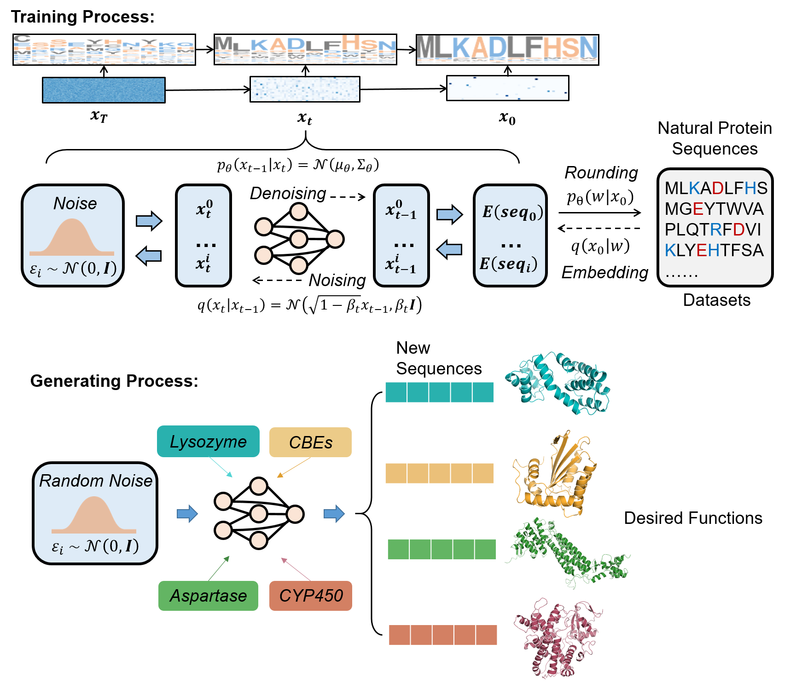

# SeqGenerator

Function-orientedEnabling Diverse Enzyme Design viathrough Function-Oriented Sequence-driven Diffusion Model

<p align = "center">

</p>
<p align = "center">
The training and generating process of our protein sequence diffusion model.
</p>


## Setup:
The code is based on PyTorch and HuggingFace `transformers`.
```bash 
pip install -r requirements.txt 
```

## Datasets
Prepare datasets and put them under the `datasets` folder. Take `datasets/aspartese` as an example. 

## Training
```bash
cd scripts
bash train.sh
```
Arguments explanation:
- ```--max_len```: the maximum length of the natrual sequences
- ```--min_len```: the minimum length of the natrual sequences
- ```--dataset```: the name of datasets, just for notation
- ```--data_dir```: the path to the saved datasets folder, containing ```train.csv  valid.csv```
- ```--resume_checkpoint```: if not none, restore this checkpoint and continue training
- ```--model_path```: the path to the used pretrained ESM-2 model, here we use "esm2_t30_150M_UR50D" which can be download [here](https://github.com/facebookresearch/esm?tab=readme-ov-file)


## Generating
You need to modify the path to ```model_dir```, which is obtained in the training stage.
```bash
cd scripts
bash run_decode.sh
```
Arguments explanation:
- ```--model_dir```: the model obtained in the training stage, our trained model can be accessed [here](https://zenodo.org/records/10405049), for generating put the model and 'training_args.json' to this folder
- ```--seq_len_sample```: the generated sequence length is obtained by sampling the length of the natural sequences of this family
- ```--max_len```: the maximum length of the generated sequence
- ```--min_len```: the minimum length of the generated sequence
- ```--seq_num```: the number of sequences generated


## Acknowledgements
This project is based on [DiffuSeq](https://github.com/Shark-NLP/DiffuSeq). Special thanks to the original authors for their contributions to the open-source community.
